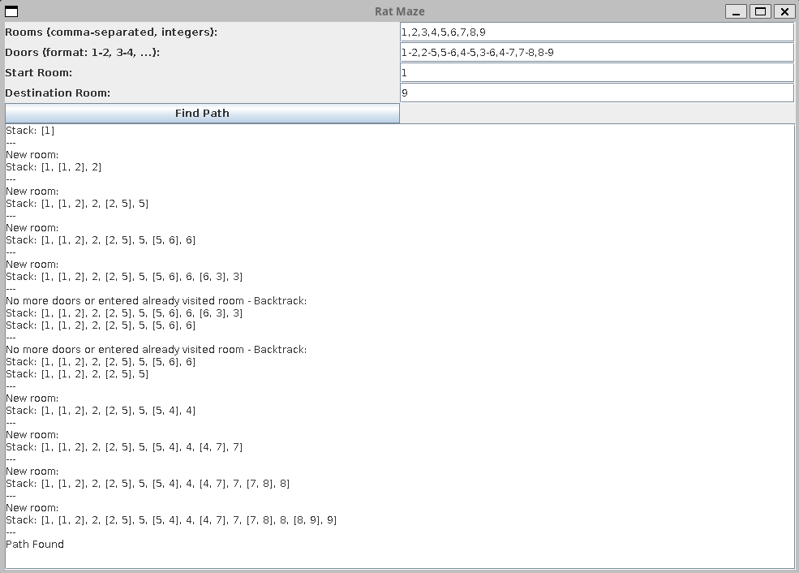
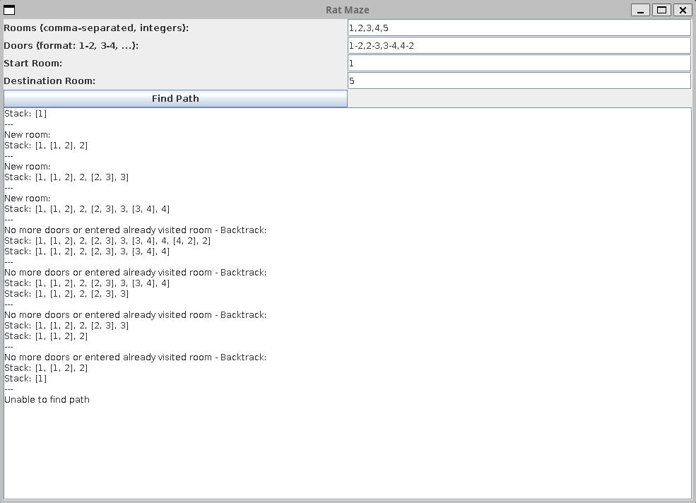

# Rat Maze 🐁

### Overview

This project is a part of the final assignment for COMPSCI 3AC3: Algorithms and Complexity. It focuses on "backtracking" algorithms.

### Code

The code for this project is written in Java and can be found in the provided file. The project utilizes the following libraries:

- Java Swing: For creating a GUI for the user to interact with the algorithm.

### Usage

Through the GUI, the user can enter information for the maze including rooms within the maze, doors that connect 2 rooms together, starting and ending position. From there, the GUI will display the steps in which the algorithm takes to find a path from the start to end position.

## Screenshots 📸

